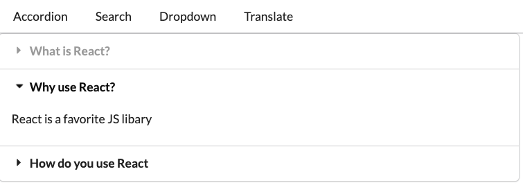

### Widget Application: 
In this application I dive in deep to the Hook system in React and go further into the inner workings of the DOM, XSS attacks, event bubbling, asynchronous code in React, and debouncing in JS

**Tools used:**

- Wikipedia API 
    - Doesn't require any API keys
    - There is a query property with a search property inside holding search results
    - I take the user input, make a request, map over the results and show them on the screen
- Semantic UI
- Axios
- Google Translate API (takes target language code and text from input and translates it. It sent me back a response and I took the translated text, update some piece of state, and showed the data on the screen)

**Components:**

- App Component: Governs information across app that holds `items` prop
- An Accordion component: In charge of showing different sets of questions and answers. The Accordion decides what questions and answers to show depending on `items` prop
- A Wikipedia API search component: Goal is to show text input so user can type in a topic. A search will be done to the Wikipedia API and results will be displayed to user. A title and summary will be included.
- A Dropdown item selection component: Is in charge of showing list of options. 
- A Google Translate API component: Responsible for showing all content on screen. The component itself will show instance of the Dropdown component and a Convert Component
- Covert Component: Responsible for taking in language input text and translating it using Google Translate API

- I then wrap up the Widgets application by building my own navigation using JS and React without a third-party library like React Router. This will be used to navigate between the different widget components that were built.
- The final result is 4 separate pages of widgets. Each widget will be wired with another by making use of links or navigation.
- Code toggles which widget is available on the screen at any given time. Widgets were built first with navigation added at the end.

### Final Result 

This project was bootstrapped with [Create React App](https://github.com/facebook/create-react-app).

## Available Scripts

In the project directory, you can run:

### `npm start`

Runs the app in the development mode.\
Open [http://localhost:3000](http://localhost:3000) to view it in the browser.

The page will reload if you make edits.\
You will also see any lint errors in the console.

### `npm test`

Launches the test runner in the interactive watch mode.\
See the section about [running tests](https://facebook.github.io/create-react-app/docs/running-tests) for more information.

### `npm run build`

Builds the app for production to the `build` folder.\
It correctly bundles React in production mode and optimizes the build for the best performance.

The build is minified and the filenames include the hashes.\
Your app is ready to be deployed!

See the section about [deployment](https://facebook.github.io/create-react-app/docs/deployment) for more information.

### `npm run eject`

**Note: this is a one-way operation. Once you `eject`, you can’t go back!**

If you aren’t satisfied with the build tool and configuration choices, you can `eject` at any time. This command will remove the single build dependency from your project.

Instead, it will copy all the configuration files and the transitive dependencies (webpack, Babel, ESLint, etc) right into your project so you have full control over them. All of the commands except `eject` will still work, but they will point to the copied scripts so you can tweak them. At this point you’re on your own.

You don’t have to ever use `eject`. The curated feature set is suitable for small and middle deployments, and you shouldn’t feel obligated to use this feature. However we understand that this tool wouldn’t be useful if you couldn’t customize it when you are ready for it.

## Learn More

You can learn more in the [Create React App documentation](https://facebook.github.io/create-react-app/docs/getting-started).

To learn React, check out the [React documentation](https://reactjs.org/).

### Code Splitting

This section has moved here: [https://facebook.github.io/create-react-app/docs/code-splitting](https://facebook.github.io/create-react-app/docs/code-splitting)

### Analyzing the Bundle Size

This section has moved here: [https://facebook.github.io/create-react-app/docs/analyzing-the-bundle-size](https://facebook.github.io/create-react-app/docs/analyzing-the-bundle-size)

### Making a Progressive Web App

This section has moved here: [https://facebook.github.io/create-react-app/docs/making-a-progressive-web-app](https://facebook.github.io/create-react-app/docs/making-a-progressive-web-app)

### Advanced Configuration

This section has moved here: [https://facebook.github.io/create-react-app/docs/advanced-configuration](https://facebook.github.io/create-react-app/docs/advanced-configuration)

### Deployment

This section has moved here: [https://facebook.github.io/create-react-app/docs/deployment](https://facebook.github.io/create-react-app/docs/deployment)

### `npm run build` fails to minify

This section has moved here: [https://facebook.github.io/create-react-app/docs/troubleshooting#npm-run-build-fails-to-minify](https://facebook.github.io/create-react-app/docs/troubleshooting#npm-run-build-fails-to-minify)
